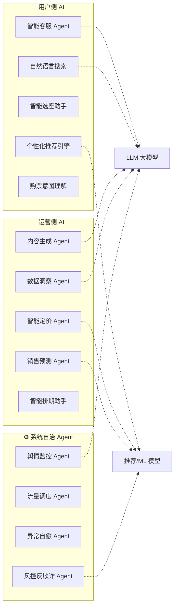
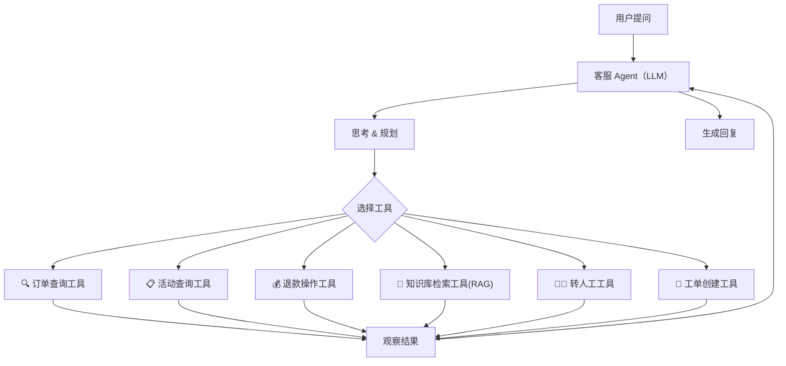
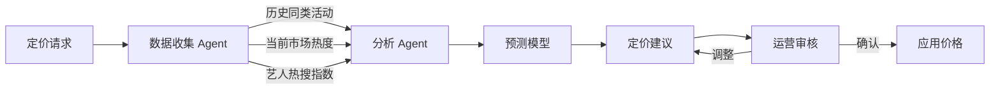
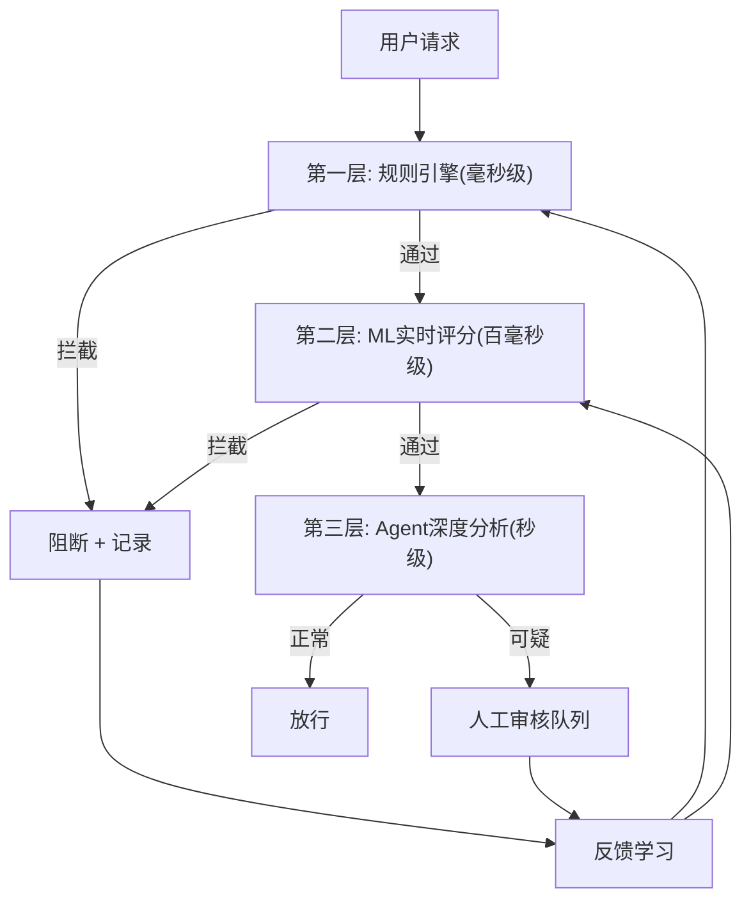
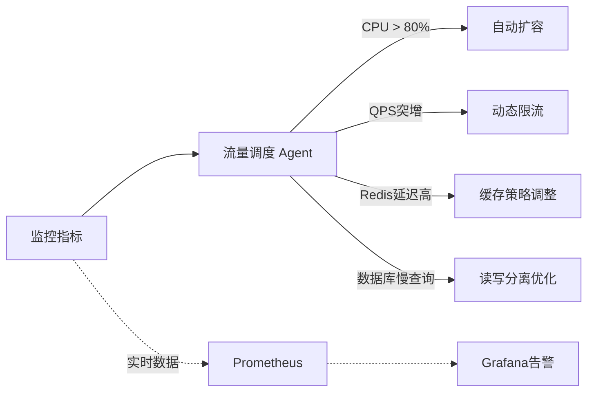
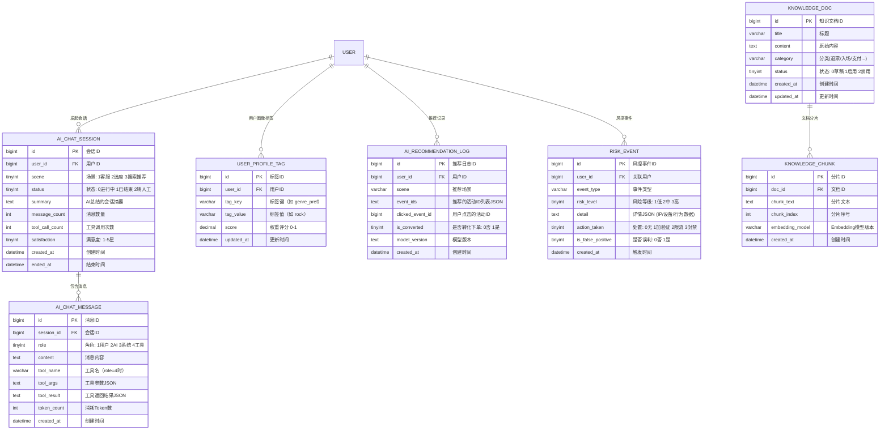
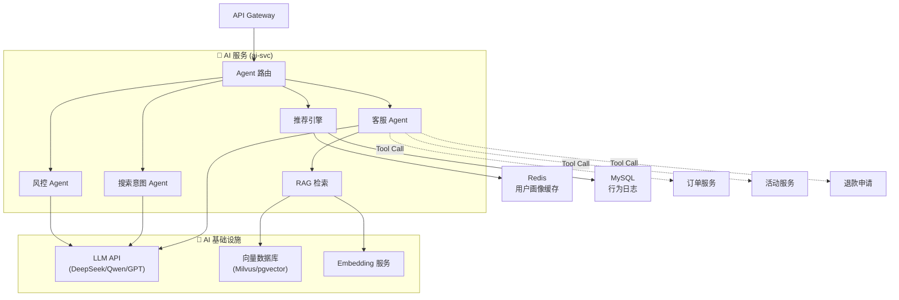

# 🤖 票务抢票系统 — AI & Agent 功能融合方案

> [!IMPORTANT]
> 本方案在原有票务系统设计基础上，融入 **AI 能力 + Agent 智能体** 概念，覆盖用户端、运营端和系统自治三个层面。

---

## 一、AI 功能全景图

将 AI 能力按使用场景分为 **用户侧 AI**、**运营侧 AI**、**系统自治 Agent** 三大类：



---

## 二、用户侧 AI 功能详细设计

### 1. 🤖 智能客服 Agent（核心功能）

> 基于 LLM 的多轮对话客服，具备 **Tool Use（工具调用）** 能力，真正的 Agent 架构。

**Agent 架构设计：**



**具备的 Tool（工具）列表：**

| 工具名 | 功能 | 示例触发 |
|--------|------|---------|
| `query_order` | 查询用户订单列表/详情 | "我的订单什么状态了？" |
| `query_event` | 查询活动信息/余票/票价 | "周杰伦演唱会还有票吗？" |
| `apply_refund` | 发起退款申请 | "我要退票" |
| `search_knowledge` | RAG 检索常见问题知识库 | "电子票怎么入场？" |
| `check_ticket_status` | 查询电子票验票状态 | "我的票能用吗？" |
| `transfer_human` | 转接人工客服 | "我要找人工" |
| `create_ticket` | 创建客诉工单 | 复杂问题升级 |

**对话示例 — Agent 多步推理：**

```
用户: 我上周买的那场演唱会，临时去不了，能退吗？

Agent 思考: 用户要退票，需要先查到具体订单 → 检查退款政策 → 执行退款
  ├─ Step 1: 调用 query_order(user_id, status=已支付, 时间=最近一周)
  │   → 找到订单 #2026022800123, 周杰伦演唱会 3/15, ￥880
  ├─ Step 2: 调用 search_knowledge("退款政策")
  │   → 活动开始前72小时可全额退款，24-72小时退80%
  ├─ Step 3: 计算距离活动还有15天，符合全额退款
  └─ 回复: 找到您的订单 #2026022800123，是3月15日周杰伦演唱会的内场票 ￥880。
          距离演出还有15天，满足全额退款条件。是否确认退款？

用户: 好的，退了吧

Agent 思考: 用户确认退款
  ├─ Step 1: 调用 apply_refund(order_id=2026022800123, reason="用户主动申请")
  │   → 退款申请已提交，预计1-3个工作日到账
  └─ 回复: 退款已提交！￥880 将在1-3个工作日原路退回。退款编号 R20260228001。
```

**技术实现要点：**

- 后端新增 **AI 服务（ai-svc）** 微服务，封装 LLM 调用和 Tool 编排
- 使用 **Function Calling** 能力（兼容 OpenAI API 格式的国产大模型）
- 会话上下文存储在 Redis（TTL 30 分钟）
- 前端使用 **SSE 流式输出**（你之前已实现过）
- 知识库使用文档切片 + Embedding + 向量数据库（Milvus/pgvector）检索

---

### 2. 🎯 个性化推荐引擎

**推荐策略矩阵：**

| 推荐场景 | 策略 | 数据来源 |
|---------|------|---------|
| 首页推荐 | 协同过滤 + 热度加权 | 用户浏览/购票/收藏记录 |
| 活动详情页 "看了又看" | Item-based 相似推荐 | 用户共现行为矩阵 |
| "猜你喜欢" | User Embedding + 内容标签 | 用户画像 + 活动标签 |
| 搜索后推荐 | 搜索意图 + 补充推荐 | 搜索词 + 无结果时降级 |
| 开票提醒智能排序 | 用户偏好评分 | 收藏 + 浏览时长 + 历史偏好 |

**用户画像标签体系：**

```
用户画像
├── 基础属性: 城市、年龄段、性别
├── 兴趣偏好: 类型偏好(演唱会/话剧/体育)、艺人偏好、价格敏感度
├── 行为特征: 活跃度、抢票成功率、退票率
└── 消费能力: 平均客单价、购票频率、VIP偏好度
```

---

### 3. 💬 自然语言搜索 & 意图理解

> 用户不再需要手动选筛选条件，直接用自然语言描述需求。

**输入 → 意图解析 → 结构化查询：**

```
用户输入: "下个月北京有什么摇滚演出，500块以内的"

LLM 意图解析 →
{
  "intent": "search_event",
  "params": {
    "city": "北京",
    "time_range": {"start": "2026-03-01", "end": "2026-03-31"},
    "category": "演唱会",
    "tags": ["摇滚"],
    "max_price": 500
  }
}

→ 转换为后端查询条件 → 返回结果
```

**能力扩展 — 多轮对话选票：**

```
用户: 帮我找个周末带孩子去的演出
Agent: 好的！请问您在哪个城市？
用户: 上海
Agent: 为您找到3场适合亲子的周末活动：
       1. 🎭 《小王子》儿童剧 - 3/8 周六 - ￥180起
       2. 🎪 太阳马戏团 - 3/9 周日 - ￥280起
       3. 🎵 迪士尼音乐会 - 3/15 周六 - ￥220起
       您对哪场感兴趣？
用户: 第2个，帮我看看有没有3张连座
Agent: [调用 check_seats(event_id, count=3, adjacent=true)]
       太阳马戏团 3/9 场次，A区有3张连座（A排12-14号），￥380/张。
       要帮您锁定吗？15分钟内需完成支付。
```

---

### 4. 🪑 智能选座助手

> 用户描述偏好，AI 自动推荐最优座位。

```
用户: 帮我选两张靠前排中间的好位置
AI分析:
  ├── 约束条件: 数量=2, 相邻=true
  ├── 偏好权重: 前排(0.4) + 中央(0.4) + 价格适中(0.2)
  ├── 可用座位评分计算
  └── 推荐: B区3排15-16号 (评分92/100)
           理由: 前排5排内+正中央位置+距离舞台约15米
```

---

## 三、运营侧 AI 功能详细设计

### 1. 💰 智能定价 Agent

> 基于市场供需、历史数据、竞品分析的动态定价建议 Agent。

**Agent 工作流程：**



**输出示例：**

```
🎯 定价建议报告 — 周杰伦2026巡回演唱会·北京站

📊 参考数据:
  - 同类演唱会平均票价: VIP ￥1580, 内场 ￥980, 看台 ￥480
  - 周杰伦2024北京站: VIP ￥1280, 内场 ￥880, 看台 ￥380 (30秒售罄)
  - 当前微博热搜指数: 9800万 (极高)
  - 鸟巢容量: 80000, 预估供需比: 1:50

💡 建议定价:
  VIP:   ￥1880 (上浮 19%, 信心度 85%)
  内场:  ￥1080 (上浮 10%, 信心度 90%)
  看台A: ￥580  (上浮 5%,  信心度 92%)
  看台B: ￥380  (持平,     信心度 95%)

⚠️ 风险提示: VIP定价上浮较大，建议关注舆情反馈
```

---

### 2. 📈 销售预测 Agent

| 预测能力 | 说明 |
|---------|------|
| 开售销量预测 | 预测开售后 1分钟/5分钟/30分钟 的销量曲线 |
| 售罄时间预测 | 预测每个票档的售罄时间点 |
| 库存调整建议 | 根据预售/关注度推荐加场或调整票档库存 |
| 服务器扩容建议 | 基于预测流量推荐开售时的服务器扩容倍数 |

---

### 3. ✍️ 内容生成 Agent

> 自动生成运营所需的各类文案内容。

| 生成能力 | 示例 |
|---------|------|
| 活动描述文案 | 输入艺人+场地+日期，自动生成吸引人的活动详情 |
| 营销推广文案 | 生成社交媒体推广文案（小红书/微博/朋友圈风格） |
| 短信通知模板 | 根据场景自动生成开票提醒/抢票成功等短信文案 |
| SEO 优化标题 | 自动生成搜索引擎友好的活动标题和描述 |
| 客服话术库 | 基于常见问题自动生成标准化客服回复模板 |

---

### 4. 📊 数据洞察 Agent（对话式 BI）

> 运营人员用自然语言提问，Agent 自动查询数据并生成可视化报告。

```
运营: 上周演唱会类活动的销售情况怎么样？

Agent:
  ├─ 调用 query_sales_data(category="演唱会", period="last_week")
  ├─ 数据分析 & 可视化
  └─ 回复:
     📊 上周演唱会类销售报告 (2/17 - 2/23):
     ─────────────────────
     总销售额: ￥2,380,000  (环比 +15%)
     总出票量: 4,200 张    (环比 +8%)
     热销 TOP3:
       1. 薛之谦巡回·上海站 - ￥980,000 (售罄)
       2. 五月天·北京站     - ￥680,000 (余票 12%)
       3. 新裤子·广州站     - ￥320,000 (余票 35%)
     
     💡 洞察: 上海市场演唱会需求旺盛，建议增加场次。
              低价票档占比过高(65%)，可考虑优化票档结构。
```

---

## 四、系统自治 Agent 详细设计

### 1. 🛡 风控反欺诈 Agent（核心 Agent）

> 实时检测并阻断黄牛、机器人、异常行为，具备自主决策和学习能力。

**Agent 多层检测架构：**



**检测维度：**

| 维度 | 检测点 | Agent 决策 |
|------|--------|-----------|
| 设备指纹 | 同一设备多账号、模拟器、改机工具 | 自动标记 + 加人机验证 |
| 行为分析 | 请求频率异常、操作路径过短（跳过浏览直接下单） | 降低优先级 / 加验证码难度 |
| IP 分析 | 代理 IP、机房 IP、同 IP 大量请求 | 动态限流 / 封禁 IP 段 |
| 关联分析 | 多个账号关联同一手机/地址/支付方式 | 标记为疑似黄牛团伙 |
| 时序分析 | 购票时间过于精确（毫秒级卡点） | 延迟处理 + 深度审查 |

---

### 2. 🌊 流量调度 Agent

> 自主感知系统负载，动态调整限流策略和资源分配。



**自治能力：**

| 场景 | Agent 自主行为 |
|------|---------------|
| 开票前 5 分钟流量骤增 | 自动预扩容服务实例、预热 Redis 缓存 |
| 某票档快速售罄 | 自动将流量引导至其他票档页面 |
| 数据库 QPS 接近阈值 | 自动提升缓存 TTL、降级非核心查询 |
| 单节点异常 | 自动摘除故障节点、通知运维 |

---

### 3. 🔧 异常自愈 Agent

| 异常场景 | Agent 自愈动作 |
|---------|---------------|
| Redis-MySQL 库存不一致 | 自动触发对账、修正 Redis 数据 |
| 消息积压超阈值 | 自动增加 Kafka Consumer 实例 |
| 支付回调丢失 | 主动轮询第三方支付查询接口补偿 |
| 订单超时未处理 | 自动触发延迟取消 + 库存归还 |

---

## 五、AI 模块新增数据表设计

在原有 ER 图基础上，新增以下 AI 相关表：



---

## 六、新增 AI 服务架构

在原有微服务架构基础上，新增一个 **AI 服务（ai-svc）**：



**技术选型建议：**

| 组件 | 推荐方案 | 理由 |
|------|---------|------|
| LLM | DeepSeek-V3 / 通义千问 / Moonshot | 国产大模型，支持 Function Calling，性价比高 |
| Embedding | text-embedding-3-small / BGE-M3 | BGE 中文效果好，部署成本低 |
| 向量数据库 | Milvus (大规模) / pgvector (轻量) | pgvector 初期足够，Milvus 可扩展 |
| Agent 框架 | 自研 (Go) / LangChain (Python微服务) | 核心链路用 Go，推荐/RAG 可用 Python |

---

## 七、前端 AI 组件新增

```
src/components/ai/
├── AiChatPanel.vue        # AI 客服悬浮聊天面板
├── AiChatBubble.vue       # 聊天气泡（支持Markdown渲染）
├── AiSearchBar.vue        # 自然语言搜索输入框
├── AiSeatRecommend.vue    # 智能选座推荐面板
├── AiEventRecommend.vue   # "为你推荐" 组件
├── AiTypingIndicator.vue  # AI 打字中动画
└── AiSatisfaction.vue     # 满意度评价组件
```

---

## 用户审核事项

> [!WARNING]
> **以下设计决策需要用户确认：**
> 1. **LLM 选型**：推荐使用 DeepSeek-V3 或通义千问（成本低+中文好），还是 OpenAI GPT-4o（效果好但贵且受限）？
> 2. **AI 服务语言**：推荐核心 Agent 用 Go 编写（统一技术栈），推荐/RAG 部分用 Python 微服务。还是全部用 Go？
> 3. **初期 AI 功能范围**：建议优先实现 ① 智能客服 Agent ② 自然语言搜索 ③ 风控 Agent。其余功能后续迭代。是否同意此优先级？
> 4. **向量数据库**：初期用 pgvector（依赖 PostgreSQL），还是直接用 Milvus（独立部署更灵活）？

## 验证方式

由于本方案为架构设计文档，验证方式主要为：

### 人工审查
- 请用户审阅此设计文档，确认 AI 功能范围、技术选型和优先级
- 审阅新增数据表是否满足业务需求
- 确认 Agent 工具列表是否覆盖核心场景
